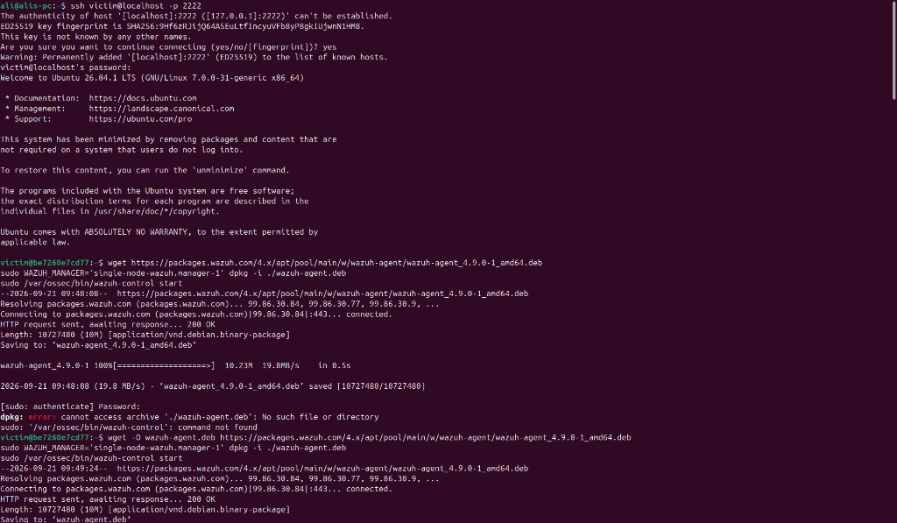
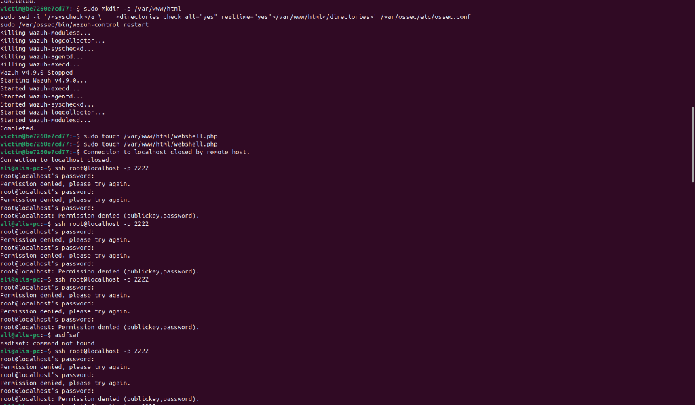
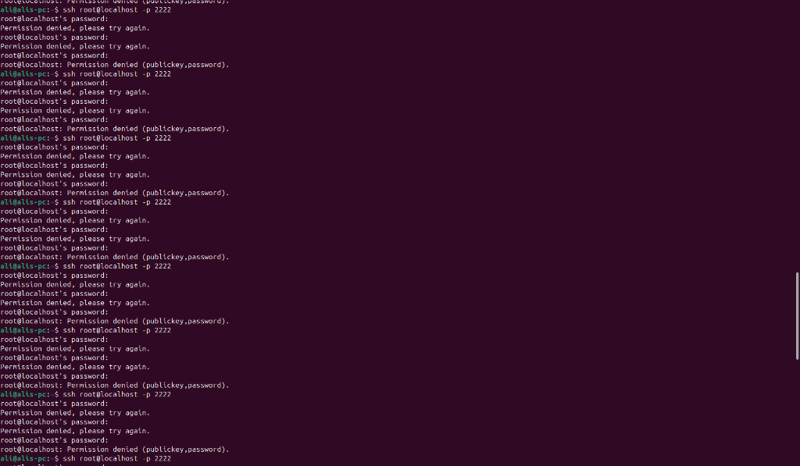
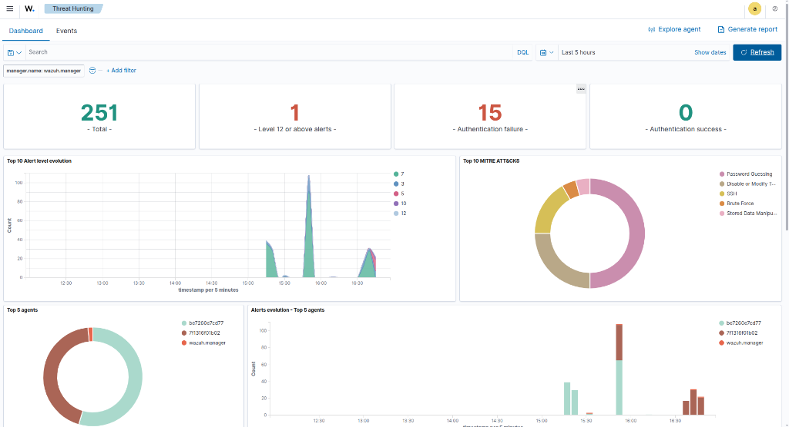
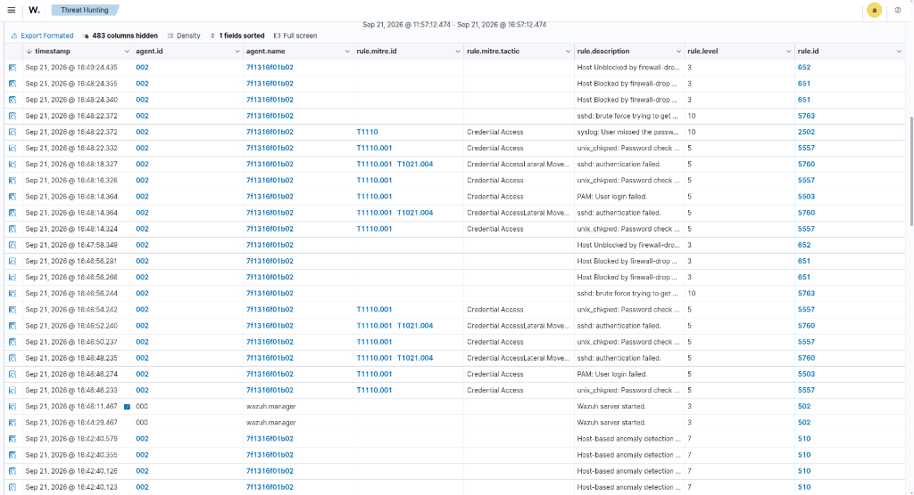

# SOC Home Lab Case Study & Incident Report

**Author:** Ali  
**Date:** September 21, 2026  
**Focus Areas:** SIEM Engineering, Threat Detection, Automated Incident Response  

---

## Executive Summary
In this project, I engineered a localized Security Operations Center (SOC) environment using Docker to simulate, detect, and automatically respond to cyber threats. Leveraging **Wazuh 4.9.0** as the primary SIEM platform, I deployed a vulnerable Ubuntu target host and successfully implemented custom File Integrity Monitoring (FIM) rules to detect malware (Webshell) drops. Furthermore, I engineered an Automated Active Response pipeline to instantly mitigate SSH brute-force attacks by dynamically blacklisting malicious IPs via `iptables`, reducing incident response time to seconds.

---

## Environment Architecture & Deployment

The lab environment was containerized to ensure isolation and reproducibility. The architecture consists of:
1. **SIEM Manager:** A single-node Wazuh Manager and OpenSearch indexer stack deployed via Docker Compose.
2. **Target Host:** A minimalist Ubuntu 24.04 container, intentionally configured with elevated network privileges (`NET_ADMIN`) to permit firewall manipulation during Active Response testing.

### Agent Provisioning
I successfully provisioned the Wazuh agent on the target host, established secure communication with the SIEM manager, and validated telemetry ingestion.



---

## Scenario 1: File Integrity & Malware Detection (Webshell)

### Methodology
To test the SIEM's ability to detect unauthorized modifications to critical web directories, I configured the Wazuh agent's `syscheck` module to perform real-time monitoring on `/var/www/html`. I then simulated an attacker dropping a PHP Webshell backdoor into the directory. 

To ensure high visibility, I authored a custom XML decoder and rule (Rule ID: `100002`) to elevate this specific file creation event to a **Level 12 (Critical)** severity alert.



### Incident Details & MITRE ATT&CK Mapping
* **Tactic:** Persistence (TA0003), Privilege Escalation (TA0004)
* **Technique:** Server Software Component: Web Shell (T1505.003)
* **Trigger Path:** `/var/www/html/webshell.php`
* **Severity:** CRITICAL (12)

### Raw Event Telemetry (JSON Snippet)
```json
{
  "timestamp": "2026-09-21T10:01:42.911+0000",
  "rule": {
    "level": 12,
    "description": "CRITICAL: Malicious Webshell Backdoor detected!",
    "id": "100002",
    "firedtimes": 1,
    "mail": true,
    "groups": ["local", "syslog", "sshd", "malware", "fim"]
  },
  "syscheck": {
    "path": "/var/www/html/webshell.php",
    "mode": "realtime",
    "event": "added"
  }
}
```

---

## Scenario 2: SSH Brute Force & Automated Active Response

### Methodology
Manual incident response is often too slow to stop automated credential stuffing. To demonstrate proactive defense, I configured the Wazuh Manager's **Active Response** module to trigger a `firewall-drop` script on the target host whenever a brute-force attack was detected. I lowered the detection threshold from the default 8 attempts down to 3 attempts to force a rapid response.

I executed the attack from the host machine against the containerized SSH daemon. On the 3rd failed password attempt, the SIEM triggered the Active Response, injecting a drop rule into the container's `iptables`, immediately severing my connection.

### Attack Simulation Terminal
*Notice the connection freezing immediately after the 3rd attempt, confirming the firewall drop execution.*


### Incident Details & MITRE ATT&CK Mapping
* **Tactic:** Credential Access (TA0006)
* **Technique:** Brute Force: Password Guessing (T1110.001)
* **Trigger Rule:** `5763` (sshd: brute force trying to get access to the system)
* **Response Rule:** `651` (Host Blocked by firewall-drop Active Response)
* **Mitigation Action:** Source IP banned via `iptables` for 60 seconds.

### Raw Event Telemetry (JSON Snippet)
```json
{
  "timestamp": "2026-09-21T11:18:24.355+0000",
  "rule": {
    "level": 3,
    "description": "Host Blocked by firewall-drop Active Response",
    "id": "651"
  },
  "data": {
    "srcip": "172.18.0.1",
    "dstuser": "root",
    "command": "add",
    "parameters": {
      "alert": {
        "rule": {
          "level": "10",
          "description": "sshd: brute force trying to get access to the system. Authentication failed.",
          "id": "5763"
        }
      },
      "program": "active-response/bin/firewall-drop"
    }
  }
}
```

---

## SIEM Dashboard Visualization & Validation

The following visualizations demonstrate the telemetry successfully arriving in the Wazuh Threat Hunting dashboard, confirming both the custom FIM detection and the automated active response actions. 

**Threat Hunting Dashboard Overview:**
This interface confirms the detection of both the Level 12 Webshell event and the SSH Brute Force attempts, dynamically categorized by MITRE ATT&CK tactics.


**Detailed Incident Logs:**
The underlying event logs validate the chronological progression of the attack: the Brute Force detection (Rule 5763) followed immediately by the Active Response Host Block (Rule 651), successfully mitigating the threat in real-time.


---

## Key Takeaways
1. **Custom Rule Authoring:** Default SIEM rules are rarely sufficient for targeted environments. Writing custom XML decoders and rules is a critical skill for reducing noise and catching specific Indicators of Compromise (IoCs).
2. **Automated Mitigation:** Implementing Active Response bridges the gap between threat detection and threat neutralization, significantly reducing the attack surface during off-hours.
3. **Containerized Security:** Adapting traditional security tools like `iptables` and `syslog` to work inside minimalist Docker environments requires a deep understanding of Linux capabilities and daemon management.
